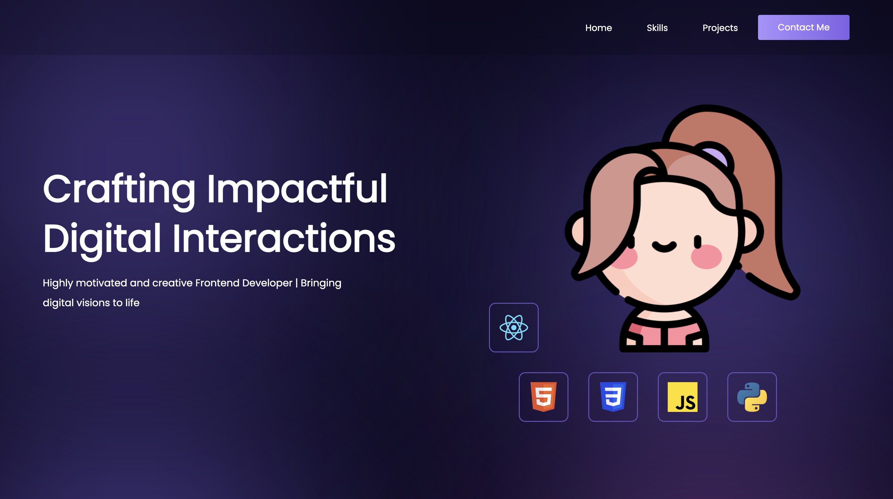
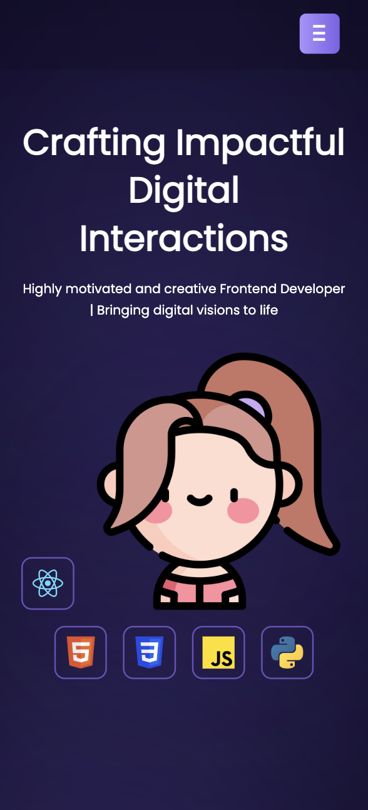

<h2 align="center">
  Portfolio Website 
  <a href="https://khinthandarkyaw98.github.io/ktdk-portfolio/" target="_blank">Khin Thandar Kyaw</a>
</h2>

  
  

 

  I implemented upon the guidance provided in <a href="https://youtu.be/yp6tRkS-QBU?si=cqC0MZFQEjcCwF11">Time To Program</a>, adjusting it to reflect my preferences.

  <a href="https://khinthandarkyaw98.github.io/ktdk-portfolio/" target="_blank">My personal portfolio </a> was built using the following technologies and tools.
  <ul>
    <li>React.js</li>
    <li>HTML5</li>
    <li>CSS3</li>
    <li>Formspree</li>
    <li>VSCode</li>
    <li>GitHub Pages</li>
  </ul>

